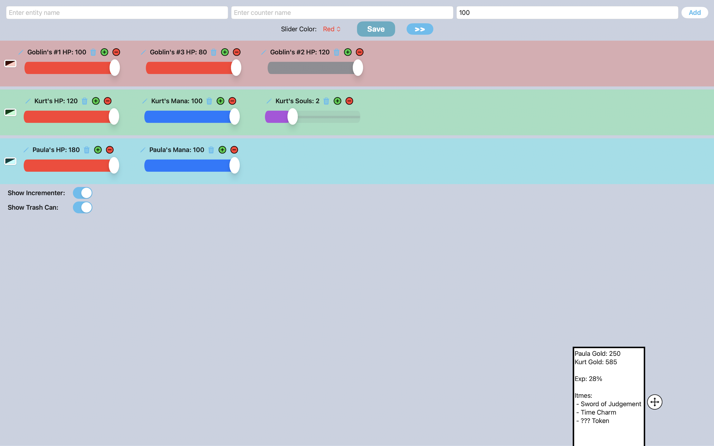
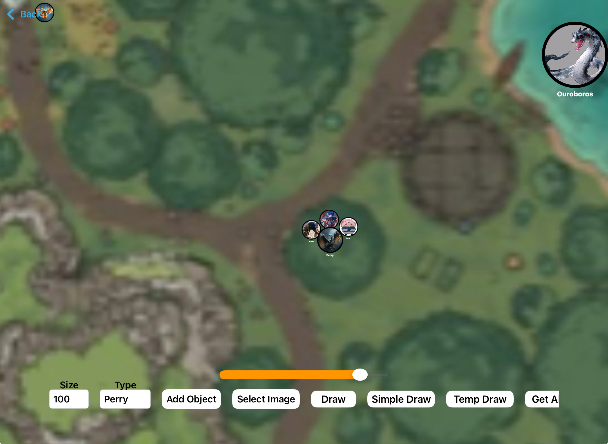

# Counter App

A RPG/game-management app designed to help manage health, mana, status effects, maps, and other gameplay information during tabletop-style roleplaying games with friends and family.

## Features

- Tracking multiple players/entities
- Custom counters
- Adjustable sliders
- Interactive Map
- Drawing system
- Moveable image objects
- Persistent saves using SwiftData and AppStorage
- Customizable UI

## Built With

- Swift
- SwiftUI
- SwiftData
- Xcode

## Screenshots

### Counter Screen

### Map Screen

## What I Learned

- SwiftUI state management
- Data persistence with SwiftData
- UI design and customization
- Drag and drop interactions
- Structuring larger multiscreen apps
- Debugging and iterative feature development

## Development Notes

Originally developed in Swift Playgrounds on iPad and later migrated to Xcode on macOS.
